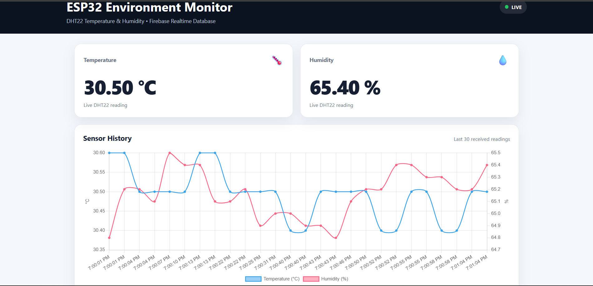
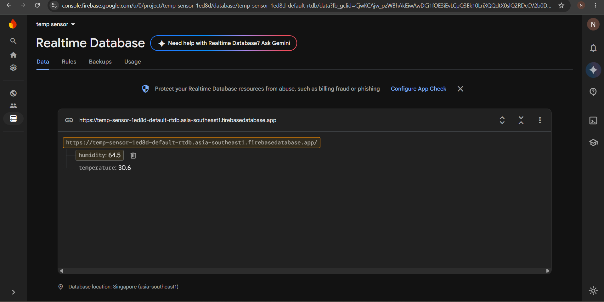

# ESP32 + DHT22 IoT Environment Monitor

An IoT-based temperature and humidity monitoring system using ESP32, DHT22, Firebase Realtime Database, Firebase Authentication, and a responsive web dashboard.

The system collects environmental data from the DHT22 sensor, sends it through the ESP32 over Wi-Fi to Firebase, and displays the data on a password-protected web dashboard.

## Live Demo

https://temp-sensor-1ed8d.web.app/

## Project Architecture

## Hardware

- ESP32 DevKit V1
- DHT22 Temperature & Humidity Sensor
- Jumper wires
- USB power supply

### Hardware Setup

## Technology Stack

### Embedded / IoT

- ESP32
- DHT22
- Embedded C/C++
- Arduino IDE
- Wi-Fi

### Cloud

- Firebase Realtime Database
- Firebase Authentication
- Firebase Hosting

### Web

- HTML
- CSS
- JavaScript
- Chart.js

## Data Flow

DHT22 Sensor
↓
ESP32
↓
Wi-Fi
↓
Firebase Realtime Database
↓
Web Dashboard

## Working Principle

1. The DHT22 measures temperature and relative humidity.
2. The ESP32 reads the sensor values.
3. The ESP32 connects to the internet through Wi-Fi.
4. Sensor data is transmitted to Firebase Realtime Database.
5. Firebase stores the incoming measurements.
6. Firebase Authentication verifies the dashboard user.
7. After successful authentication, the web dashboard retrieves the sensor data.
8. Temperature and humidity are displayed on the dashboard.
9. Historical measurements are visualized using a graph.

## Web Dashboard

The dashboard provides:

- Temperature monitoring
- Humidity monitoring
- Historical data visualization
- Firebase connection status
- Sensor status
- Last updated information
- Responsive web interface
- Password-protected access

## Dashboard Authentication

The web dashboard uses Firebase Authentication.

Users must provide valid Firebase authentication credentials to access the monitoring dashboard.

The actual password is intentionally not published in this repository.

## Firebase Database

Firebase Realtime Database is used as the cloud backend for storing sensor measurements.

## Project Components

| Component | Purpose |
|---|---|
| DHT22 | Measures temperature and humidity |
| ESP32 | Reads sensor data and provides Wi-Fi connectivity |
| Firebase Realtime Database | Stores sensor measurements |
| Firebase Authentication | Authenticates dashboard users |
| Firebase Hosting | Hosts the web dashboard |
| Web Dashboard | Displays sensor data |
| Chart.js | Visualizes historical measurements |

## Testing

The system was tested for:

- DHT22 temperature readings
- DHT22 humidity readings
- ESP32 Wi-Fi connectivity
- Firebase connectivity
- Firebase database updates
- Firebase authentication
- Web dashboard updates
- Historical graph visualization
- Dashboard sign-out functionality

The DHT22 successfully provided temperature and humidity measurements, while the ESP32 transmitted the data to Firebase for visualization through the authenticated web dashboard.

## Deployment

The web dashboard is deployed using Firebase Hosting.

Live deployment:

https://temp-sensor-1ed8d.web.app/

## Project Outcome

The project demonstrates an end-to-end IoT monitoring pipeline:

Physical Sensor → Embedded System → Internet → Cloud Database → Web Application

It combines embedded systems, sensor interfacing, IoT communication, cloud database integration, authentication, and web development into a single working system.

## Future Improvements

- Add multiple environmental sensors
- Add automatic alerts for abnormal temperature and humidity
- Add mobile notifications
- Add data export functionality
- Add advanced data analytics
- Add long-term environmental data storage
- Add OTA firmware updates
- Add additional IoT sensors
- Add improved user and access management

## Author

NalinKumar K

## License

This project is intended for educational and learning purposes.
