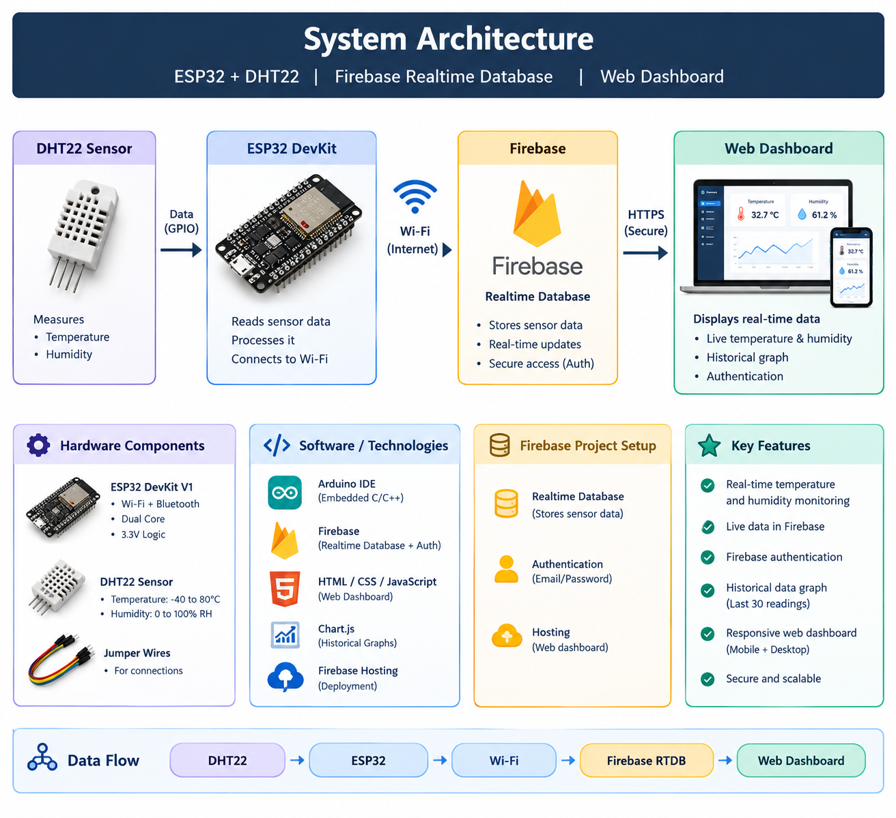
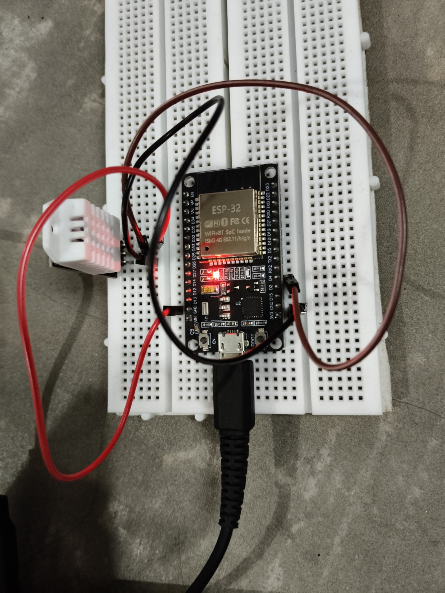

# ESP32 + DHT22 IoT Environment Monitor

An IoT-based temperature and humidity monitoring system using ESP32, DHT22, Firebase Realtime Database, Firebase Authentication, and a responsive web dashboard.

The system collects environmental data from the DHT22 sensor, sends it through the ESP32 over Wi-Fi to Firebase, and displays the data on a password-protected web dashboard.

---

## Live Demo

https://temp-sensor-1ed8d.web.app/

---

## Project Architecture



### Data Flow

DHT22 Sensor  
↓  
ESP32  
↓ Wi-Fi  
Firebase Realtime Database  
↓  
Web Dashboard

---

## Hardware

- ESP32 DevKit V1
- DHT22 Temperature & Humidity Sensor
- Jumper wires
- USB power supply

### DHT22 Connections

| DHT22 Pin | ESP32 |
|---|---|
| VCC | 3.3V |
| DATA | GPIO 4 |
| GND | GND |

### Hardware Setup



---

## Technology Stack

### Embedded / IoT

- ESP32
- DHT22
- Embedded C/C++
- Arduino IDE
- Wi-Fi

### Cloud

- Firebase Realtime Database
- Firebase Authentication
- Firebase Hosting

### Web

- HTML
- CSS
- JavaScript
- Chart.js

---

## Repository Structure

```text
tmp-sns/
│
├── firmware/
│   └── esp32_dht22.ino
│
├── images/
│   ├── architecture.png
│   ├── hardware.jpg
│   ├── dashboard.png
│   └── firebase.png
│
├── public/
│   └── index.html
│
├── .firebaserc
├── .gitignore
├── firebase.json
└── README.md
